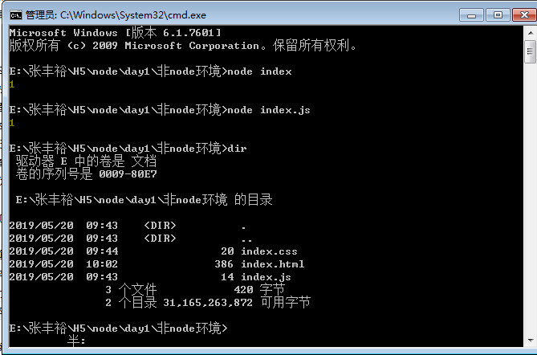

# Node


Node就是把谷歌浏览器的控制台单独抽离了出来(抽离出来的其实是一个运行JS的引擎)，以前我们运行JS必须在浏览器的环境下，现在因为我们把这个(Chrome V8)引擎拿出安装在系统(手机系统，电脑系统，车载系统)上面，并把他命名为(Node)

JS从此获得新生(JS以前很孤独，它只能在浏览器区域运作)，因为浏览器把这块土壤放到外部(系统)，JS运行在浏览器的外部，活动范围变大了，从前端语言进化为后端语言（掌握系统的增删查改的权限）

# 检查Node环境是否安装成功

查看的是你当前Node的版本号

```sh
node -v
```

#  用Node运行JS



你可以在命令行或者终端里面直接运行JS，相对于以前在浏览器里面运行JS是很大的不一样
```sh
node [JS的文件名]
node index.js
node index
```

# 模块化

- require.js 模块化
- `<script type="module" src="xxx.js">`
- gulp模块

优势

模块其实就是把复杂的JS，HTML，CSS分成一小段

房子在构建过程中会有很多耗材（钉子，木头，铁，螺丝，斧头，锤子），这些小部件其实本质就是一个模块，这些模块互相结合，最终成为一个大厦

- 分工明确
- 容易找锅，容易找出错误
- 方便管理
- 按需加载

二阶段最经典的模块化，把每份JS分开写，每份JS单独做对应的逻辑，`jquery`负责提供这个操作DOM和BOM的API，AJAX的请求，`jquery-swiper.js`提供轮播图效果(滑块容器)

```html
<script src="jquery.js"></script>
<script src="jquery-swiper.js"></script>
<script src="index.js"></script>
```

### require

使用它来引入外部模块，我们可以新建index.js

```js
console.log(1);
// require引入，获取的意思
require('./module1.js');
// 引入了module2的模块，并且赋值给teacher变量
var teacher = require('./module2');

console.log(teacher.plus(teacher.age , 1));
```

### module.exports

module模块的意思，export是导出的意思

配合`module.exports`导出所需的模块，使用`require`引用，按需加载
```js
// module2.js
var obj = {
    name: "yao",
    age: 18,
    skill: ['ps', 'js', 'css'],
    plus: function (num1, num2) {
        return num1 + num2
    }
}

// 导出模块
// 把上面的obj导出外部使用
module.exports = obj;
```
```js
console.log(2);
```

此时模块1`module1.js`和模块2`module2.js`各司其职，分工明确，配合`index.js`引入这些模块，然后使用完成主逻辑


